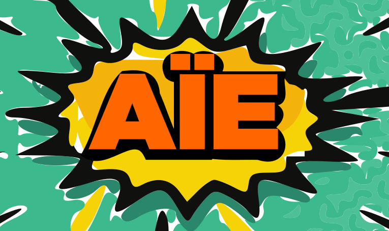
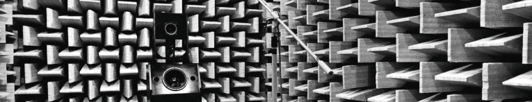
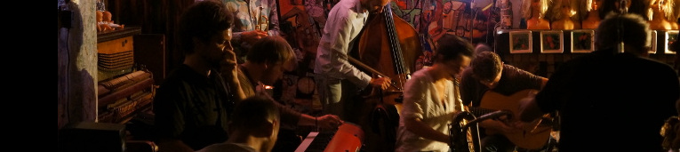
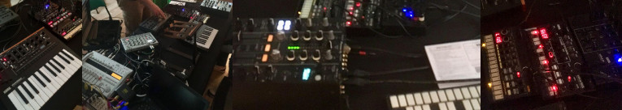

# L'Atelier Impro/Électro

## Concept et manifeste

L'Atelier d'Improvisation Électronique (AÏE) est un rendez-vous
régulier entre beatmakers et musiciens improvisateurs (ensembles non
disjoints) de la région de Lorient. Il s'agit de créer une musique
originale qui naît des possibilités offertes par la rencontre, dans la
tradition de [l'improvisation
libre](https://fr.wikipedia.org/wiki/Musique_improvis%C3%A9e).

Tous les dispositifs sonores sont bienvenus, de la station
MAO à la flûte à bec !

Lire [le manifeste](/manifeste-aie).

## Espace sonore

La notion d'espace sonore est au coeur de la pratique : il
s'agit de l'organiser, de le partager. Les participants
proposent des idées musicales et rythmiques qui se
développent de façon organique à travers des modifications,
contradictions, abandons, reprises.

Deux écueils existent : l'inflation en volume et la
persistance immuable d'éléments &mdash; deux façons de tuer
l'échange et lui substituer un dialogue de sourds. La
pratique d'une écoute active est essentielle, et décider ne
pas jouer est à tout moment un acte musical positif.

## Éléments stylistiques

L'accent porté sur l'électronique favorise une musique
horizontale, basée sur des boucles (loops) et des motifs
(patterns), ce qui rend d'autant plus cruciale la prise de
conscience des écueils ci-dessus, par exemple pour rendre
possible un tempo mouvant ou des transitions. La musique produite n'a pas
d'étiquette a priori et ne cherche pas absolument à en
avoir.

Tout réemploi d'éléments portés par les musiciens (et
constitutif de leur identité musicale) est encouragé, dans
l'esprit d'un jazz vivant, fait de chocs et de métissages.

## Composition et improvisation

Les éléments utilisés par les musiciens lors d'une session
peuvent être préparés et doivent être cohérents afin de
permettre l'émergence d'un geste musical, qui rend la
musique lisible. Une préparation minutieuse peut être
assimilée à une composition : l'opposition entre composition
est improvisation est arbitraire et n'a pas de raison d'être
dans notre contexte.

## Machines et instruments

Les dispositifs de production sonore se partagent, se
bricolent, se contrôlent, se programment potentiellement à
plusieurs. Des temps sont réservés pour présenter les
possibilités expressives des instruments, leur vocabulaire.

Il est souhaitable de connaître un peu nos propres machines, ne
serait-ce que pour mieux les présenter aux autres !
Attention aussi au temps de branchement pour qu'il n'empiète
pas trop sur la pratique.

## Concerts

L'Atelier se produit régulièrement en public dans des lieux variés,
dont [l'Embarcadère](https://www.instagram.com/lembarcadere_lorient/)
de Lorient.  Il a également pour vocation d'encourager l'émergence
d'ensembles réduits, réguliers ou éphémères, au gré des symbioses et
des convergences musicales.

Des synergies avec des
plasticiens, des vidéastes, des danseurs, des acteurs sont également à
explorer, voir par exemple [la Rallonge](http://larallonge.franceimpro.net).

