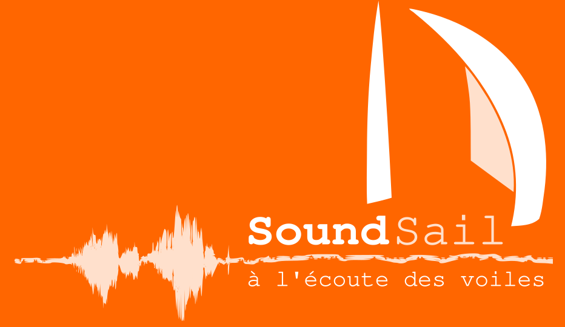

## Musique Environnementale de Lorient

MEL représente l’environnement sonore de Lorient vu par des artistes,
des habitants, des travailleurs, toute personne qui tend l’oreille, le
micro et qui s’intéresse à cet espace sonore. Personne ne possède MEL
mais des acteurs, comme l’association Musik Europa Breizh, font des
projets autour, constituant un collectif. Contact : <mel@musik-europa-breizh.fr>
	
## Balades sonores
      
MEL organise des **Balades Sonores** dans le pays de Lorient. Une
Balade Sonore est une déambulation lente sur un parcours,
dirigée par une personne qui aura choisi un trajet intéressant
d’un point de vue (ou d’ouïe) sonore. Le but est de
redécouvrir des sons du quotidien ou (et) d’en découvrir de
nouveaux dans un contexte d’écoute partagée. Peut être même
d’entendre ces sons comme de la musique ! Le mieux, pour
comprendre, c’est d’essayer :-)

Les balades sonores peuvent optionnellement être enregistrées,
puis retravaillées en compositions, offrant un portrait sonore
des lieux dans le temps du parcours.

Les balades sont organisées par Raphaël Bruni d’Achon,
musicologue. Inscrivez-vous [par
mail](mailto:mel@musik-europa-breizh.fr) et/ou rejoignez-nous sur le
[discord MEL](https://discord.gg/JzdUFrK4sx).
      

## SoundSail

[SoundSail](https://soundsail.cc) est une oeuvre sur les métiers qui
gravitent autour de la course au large.  Nous avons enregistré et
photographié les acteurs de ces métiers riches et complexes que le
grand public ne connaît pas forcément.  Le son produit par des
gestes de précision possède une musicalité que nous présentons
dans une installation sonore et visuelle.
      
## Atelier Impro/Électro : quand MEL s'en mèle !

      
L'[AIE](/aie) propose des ateliers d'improvisation ouverts à tous et
toutes plusieurs fois par mois, ainsi que des concerts. Ces deux
cadres permettent l'utilisation de sons issus de MEL pour créer des
musiques mixtes : musique environnementale et musique improvisée.

