<form method="post" action="https://newsletter.infomaniak.com/v3/api/1/newsletters/webforms/16806/submit" class="inf-form"><input type="email" name="email" style="display:none" /><input type="hidden" name="key" value="eyJpdiI6InhET3E3MDFFRlI5M2tDbDZpdzd4OFc2WDlCUCsxR3NoUXhDQ0FNbWZwbnM9IiwibWFjIjoiMjBhZTllNTczNjJjNTFmYjkyMDM1NzdjNzBiYzUwZmNmNjI1ZGNkZDQ4ZWNmOGI0NTUyZTA4MTAyODBkZGZlNSIsInZhbHVlIjoiQkw1ZmRXT0hjUnl2Tmxhb203a2I0ckF3MkVSb1NLNVNpTW9wejhSaUdPWT0ifQ=="><input type="hidden" name="webform_id" value="16806">
 <h4>Concerts Musik Europa Breizh</h4> Ne ratez plus de concert : inscrivez-vous à notre liste de diffusion ! 
 <h4>Votre inscription a été enregistrée avec succès !</h4> 
 <a href="#" class="inf-btn">&laquo;</a> 
 
 
 
 <input type="email" name="inf[1]" data-inf-meta="1" data-inf-error="Merci de renseigner une adresse email" required="required" placeholder="Email *" > 
 
Vous pouvez à tout moment utiliser le lien de désabonnement intégré dans chacun de nos mails.

Attention : si vous ne recevez pas notre email de confirmation d'inscription, vérifiez s'il n'est pas dans votre dossier de messages indésirables (spam).
  <altcha-widget hidelogo hidefooter floating challengeurl="https://newsletter.infomaniak.com/v3/altcha-challenge" ></altcha-widget>   
 <input type="submit" style="margin-top: 25px;" name="" value="Valider"> 
 
 
 </form>

Vous pouvez aussi [adhérer à l'association](/adhesion), ce
qui vous donnera droit à un tarif réduit en plus de toutes les
informations dans votre boîte mail !

## Billetterie

Les concerts à venir sont dans l'ordre chronologique : vous pouvez acheter vos billets pour toute la saison !

### 2026

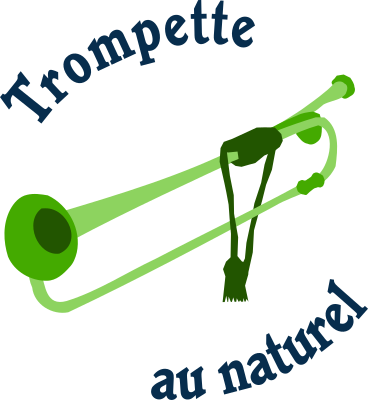 
[jeudi 9 juillet, 20h, salle Artimon, Locmiquélic](/reservations/2026-07-09) 
[vendredi 10 juillet, 20h, chapelle de Lomener](/reservations/2026-07-10) 
[samedi 11 juillet, 20h, église de Clohars-Fouesnant](/reservations/2026-07-11) 

**Los pasos perdidos** 
[mercredi 19 août, 20h, église de Clohars-Fouesnant](/reservations/2026-08-19) 
[jeudi 20 août, 20h, salle Artimon, Locmiquélic](/reservations/2026-08-20) 
[vendredi 21 août, 20h, chapelle de Lomener](/reservations/2026-08-21) 

**Maestras : femmes compositrices** 
[jeudi 8 octobre, 20h, chapelle de Lomener](/reservations/2026-10-08) 
[vendredi 9 octobre, 20h, salle Artimon, Locmiquélic](/reservations/2026-10-09) 
[dimanche 11 octobre, 17h, église de Clohars-Fouesnant](/reservations/2026-10-11) 

## Concerts passés

Les concerts passés sont dans l'ordre antéchronologique, du plus récent au plus ancien.

### 2026

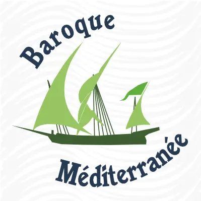 
[mardi 26 mai, 20h, église de Clohars-Fouesnant](/reservations/2026-05-26) 
[mercredi 27 mai, 20h, chapelle de Lomener](/reservations/2026-05-27) 
[jeudi 28 mai, 20h, salle Artimon, Locmiquélic](/reservations/2026-05-28) 

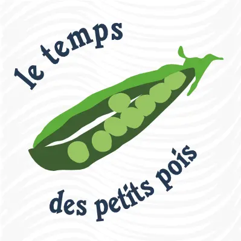 
[mercredi 22 avril, 20h, église de Larmor-Plage](/reservations/2026-04-22) 
[jeudi 23 avril, 20h, église de Clohars-Fouesnant](/reservations/2026-04-23) 
[vendredi 24 avril, 20h, salle Artimon, Locmiquélic](/reservations/2026-04-24) 

### 2025

 
Le Messie de Haendel : oratorio pour chœur, solistes et orchestre 
[Vendredi 19 décembre, 20h, église St Pierre, Ploemeur](https://www.echodesvagues.fr/pages/concerts/billetterie.html)

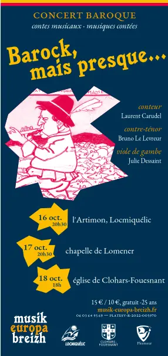 
[16/10, salle Artimon, Locmiquélic](/reservations/2025-10-16) 
[17/10, chapelle de Lomener](/reservations/2025-10-17) 
[18/10, église de Clohars-Fouesnant](/reservations/2025-10-18)

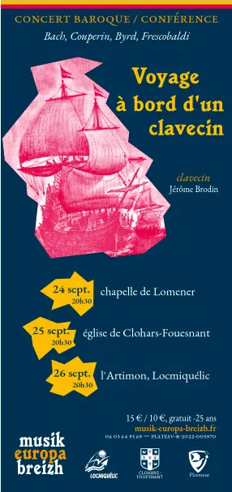 
[24/09, chapelle de Lomener](/reservations/2025-09-24) 
[25/09, église de Clohars-Fouesnant](/reservations/2025-09-25) 
[26/09, salle Artimon, Locmiquélic](/reservations/2025-09-26)

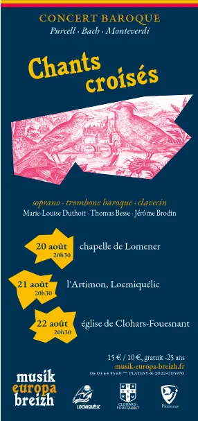 
[20/08, chapelle de Lomener](/reservations/2025-08-20) 
[21/08, salle Artimon, Locmiquélic](/reservations/2025-08-21) 
[22/08, église de Clohars-Fouesnant](/reservations/2025-08-22)

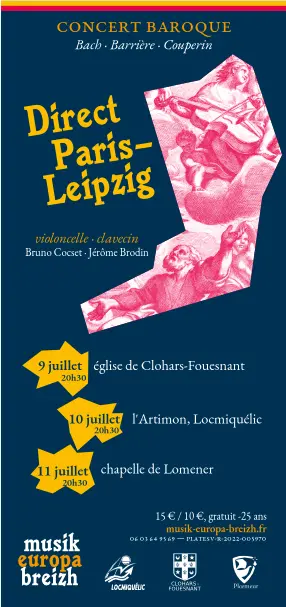 
[09/07, église de Clohars-Fouesnant](/reservations/2025-07-09) 
[10/07, salle Artimon, Locmiquélic](/reservations/2025-07-10) 
[11/07, chapelle de Lomener](/reservations/2025-07-11)

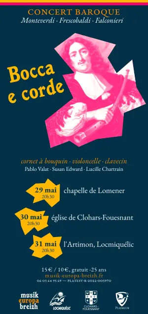 
[29/05, chapelle de Lomener](/reservations/2025-05-29) 
[30/05, église de Clohars-Fouesnant](/reservations/2025-05-30) 
[31/05, salle Artimon, Locmiquélic](/reservations/2025-05-31)

### 2024

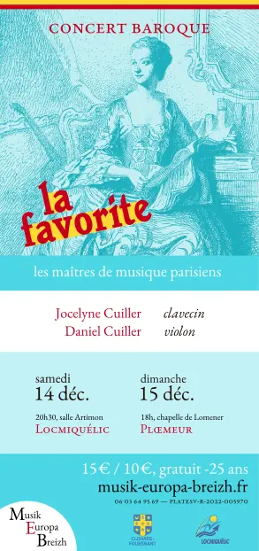 
[14/12, salle de l'Artimon, Locmiquélic](/reservations/2024-12-14) 
[15/12, chapelle de Lomener](/reservations/2024-12-15) 

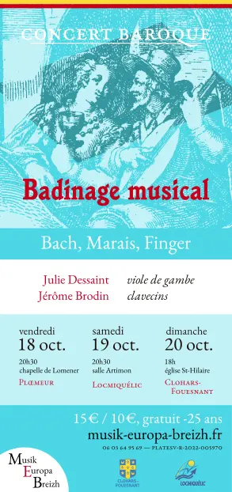 
[18/10, chapelle de Lomener](/reservations/2024-10-18) 
[19/10, salle de l'Artimon, Locmiquélic](/reservations/2024-10-19) 
[20/10, église de Clohars-Fouesnant](/reservations/2024-10-20) 

[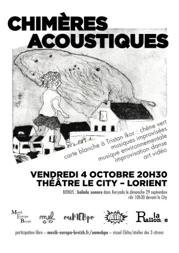](/posts/2024-09-20-chimeres-acoustiques/) 
[04/10, Théâtre Le City](/posts/2024-09-20-chimeres-acoustiques/), participation libre.

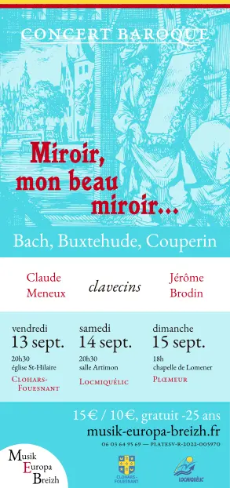 
[13/09, église de Clohars-Fouesnant](/reservations/2024-09-13) 
[14/09, salle de l'Artimon, Locmiquélic](/reservations/2024-09-14) 
[15/09, chapelle de Lomener](/reservations/2024-09-15) 

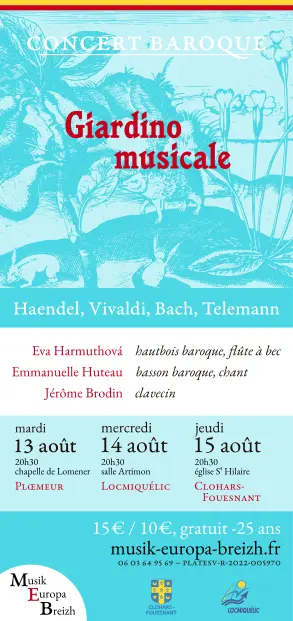 
[13/08, chapelle de Lomener](/reservations/2024-08-13) 
[14/08, salle de l'Artimon, Locmiquélic](/reservations/2024-08-14) 
[15/08, église de Clohars-Fouesnant](/reservations/2024-08-15) 

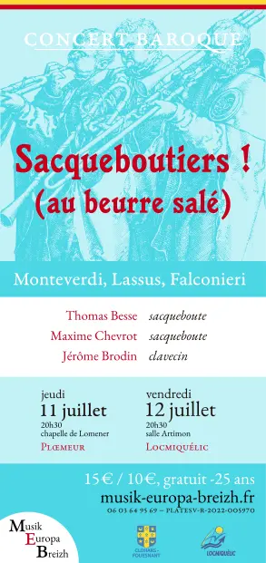 
[10/07, Fouesnant, festival Chambre avec Vue](/reservations/2024-07-10) 
[11/07, chapelle de Lomener](/reservations/2024-07-11) 
[12/07, salle de l'Artimon, Locmiquélic](/reservations/2024-07-12) 

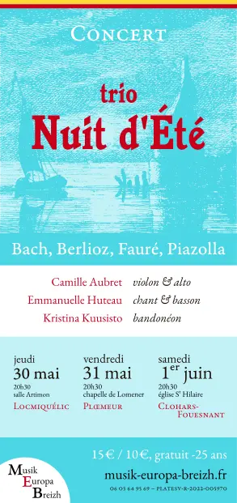 
[30/05, salle de l'Artimon, Locmiquélic](/reservations/2024-05-30) 
[31/05, chapelle de Lomener](/reservations/2024-05-31) 
[01/06, église de Clohars-Fouesnant](/reservations/2024-06-01)

### 2023

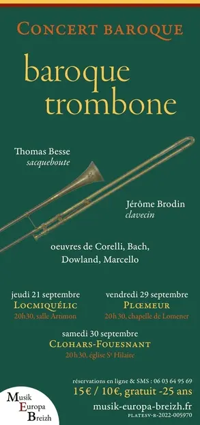 
21/09, salle de l'Artimon, Locmiquélic 
29/09, chapelle de Lomener 
30/09, église de Clohars-Fouesnant

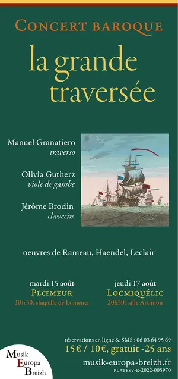 
15/08, chapelle de Lomener 
16/08, église de Clohars-Fouesnant 
17/08, salle de l'Artimon, Locmiquélic

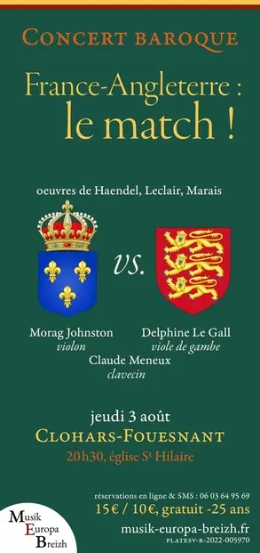 
03/08 église de Clohars Fouesnant
  
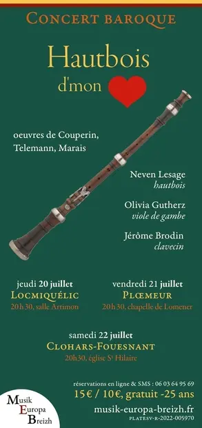 
20/07, salle de l’Artimon à Locmiquélic 
21/07, chapelle de Lomener 
22/07 église de Clohars Fouesnant

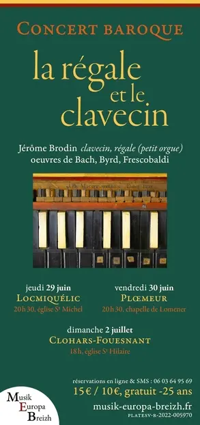 
29/06, salle de l’Artimon à Locmiquélic 
30/06, chapelle de Lomener 
02/07 église de Clohars Fouesnant

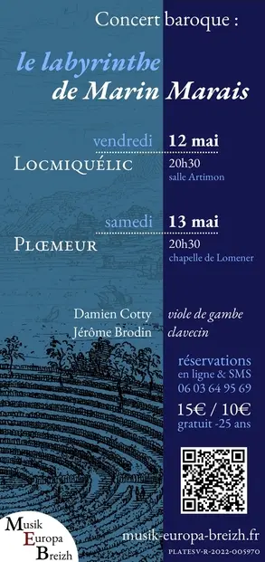 
12/05, salle de l’Artimon à Locmiquélic 
13/05, chapelle de Lomener 
14/05 église de Clohars Fouesnant

### 2022

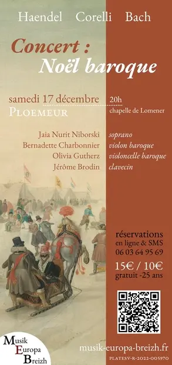 
17/12 chapelle de Lomener 
18/12 église de Nizon en Pont Aven (Préludes de Pont Aven)

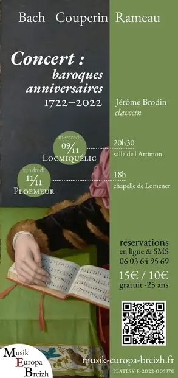 
24/08 chapelle St Anne, Fouesnant (Chambre avec Vue) 
09/11 salle de l’Artimon, Locmiquélic 
11/11 chapelle de Lomener, Ploemeur

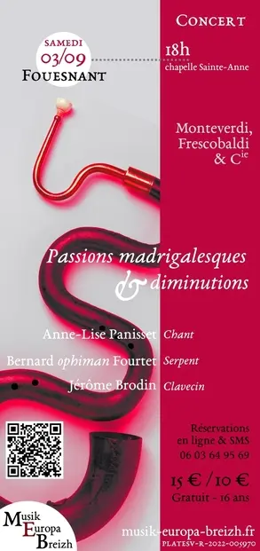 
31/08 Riantec 
02/09, chapelle de Lomener 
03/09, chapelle sainte Anne Fouesnant

 
13/04, salle de l’Artimon à Locmiquélic 
18/04, chapelle de Lomener 
21/07 église de Clohars Fouesnant

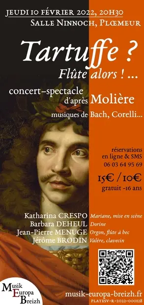 
10/02, Ploemeur

